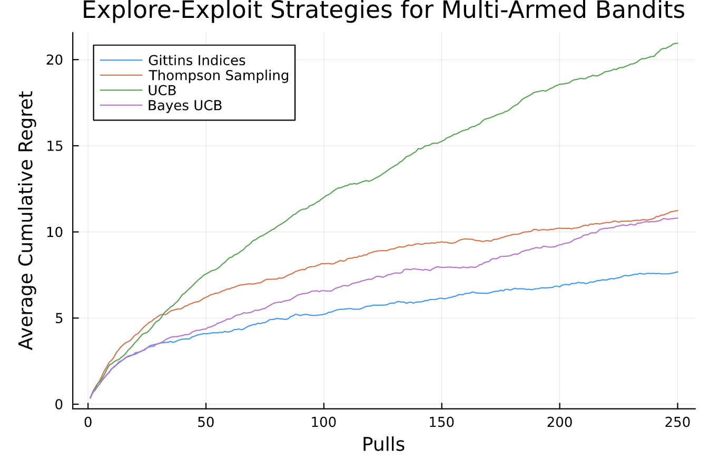

# GittinsIndices

[](https://ydalmia.github.io/GittinsIndices.jl/stable/)
[](https://ydalmia.github.io/GittinsIndices.jl/dev/)
[](https://github.com/ydalmia/GittinsIndices.jl/actions/workflows/CI.yml?query=branch%3Amain)
[](https://codecov.io/gh/ydalmia/GittinsIndices.jl)

Gittins indices give an optimal solution for the multi armed bandit problem. This package contains utilities to compute the gittins index for three main cases: bernoulli arms, gaussian arms, and arbitrary discrete stochastic processes.

Although traditionally they are used in the infinite, discounted regret setting, they often perform better in practice than incumbent alternatives, even in finite horizon settings:



## Installation
```julia
using Pkg; 
Pkg.add("GittinsIndices")
```

## Usage
Let's say our current belief in an arm is represented by the prior distribution Beta(2, 3). In other words, we have observed one success, and two failures. And, our discount factor is 0.7. To calculate the gittins index of this arm, we would then obtain the arm's gittins index as follows:

```julia
gi = calculate_bernoulli_gittins(
    alpha = 2,
    beta = 3,
    gamma = 0.7,
)
```

If we wanted to precompute a table of gittins indices for a number of Beta priors, we could instead do:

```julia
gis = calculate_bernoulli_gittins(
    alpha = 2,
    beta = 3, 
    gamma = 0.7,
    pulls = 100,
) 
gis[1, 1] # corresponds to Beta(2, 3)
gis[1 + i, 1 + j] # corresponds to Beta(2 + i, 3 + j)
```

Similarly, the package provides functions to precompute gaussian gittin indices and the gittins index for arbitrary stochastic processes. 

